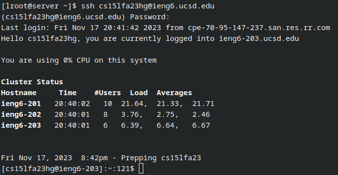

## Logging into ieng6:  
keys pressed: `ssh cs15lfa23hg@ieng6 <tab>` to autofill the address (ieng6.ucsd.edu), `<enter>` to execute the command  

## Cloning the repository:
keys pressed: `git clone <ctrl + shift + v>` to paste in the address, `<enter> `to execute the command  

## Running the tests:
keys pressed: `cd lab7 <enter> `to move to the new directory, `bash ./t <tab> <enter>` to run the testing script  

## Editing the code file:
keys pressed: `vim L <tab> . <tab> <enter>` to autofill the `ListExamples.java` file, by some stroke of luck my cursor ended up exactly where I needed to edit so `<ctrl  + home>` to go to the beginning of the file and `<ctrl + end> <up> <up> <up> <up> <up> <up> we r2 :wq <enter>` to navigate to the required location, replace the 1 with a 2, save, and exit the file.  

## Rerunning the tests:
keys pressed: `bash ./t <tab> <enter>` to rerun the test script.  \

## Committing and pushing the changes:
keys pressed: `git add L <tab>` to add the changed file to the commit, `git commit -m "yeehaw"` to commit the changes locally, `git push` to push the changes to the GitHub repository.  \

